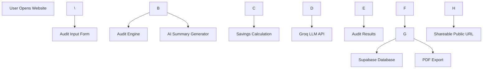

\# ARCHITECTURE

\# System Overview

CREDEX AI Spend Audit is a SaaS-style audit platform designed to analyze AI tooling spend across startups and engineering teams.

The application uses a hybrid architecture:

\* deterministic pricing logic for financial calculations

\* LLM-based summaries for personalization

\* Supabase for persistence and shareable reports

\---

\# System Diagram

\---

\# Data Flow

\## 1. User Input

The user enters:

\* AI tools

\* pricing plans

\* seat count

\* monthly spend

\* primary use case

Form state persists during interaction and dynamically updates tool selections.

\---

\## 2. Audit Engine

The pricing engine evaluates:

\* current vendor plan

\* seat utilization

\* alternative plans

\* downgrade opportunities

\* potential savings

The engine uses deterministic rule-based logic instead of AI-generated calculations because financial outputs must remain explainable and reproducible.

\---

\## 3. AI Summary Generation

After the audit calculation completes:

\* user audit data is sent to the Groq LLM API

\* the model generates a personalized executive summary

\* fallback handling exists for API failures

The AI layer is intentionally limited to explanation and recommendation language, not pricing calculations.

\---

\## 4. Persistence Layer

Audit reports are stored in Supabase.

Stored data includes:

\* team size

\* tools

\* savings estimates

\* AI summary

\* generated recommendations

Each report receives a unique shareable public URL.

\---

\# Tech Stack Decisions

| Layer      | Technology      |

| ---------- | --------------- |

| Frontend   | Next.js         |

| Language   | TypeScript      |

| Styling    | Tailwind CSS    |

| Animations | Framer Motion   |

| Backend    | Supabase        |

| AI         | Groq API        |

| Forms      | React Hook Form |

| Hosting    | Vercel          |

\---

\# Why Next.js

Next.js was selected because it provides:

\* server-side rendering

\* dynamic routing

\* API support

\* strong TypeScript ecosystem

\* excellent Vercel deployment integration

The assignment required a production-style web application rather than a static frontend.

\---

\# Why TypeScript

TypeScript improves:

\* maintainability

\* refactoring safety

\* pricing engine reliability

\* form validation consistency

This was particularly important for financial calculations and audit logic.

\---

\# Scaling to 10k Audits/Day

If the system needed to scale significantly:

\## Changes I would make

\### 1. Queue AI requests

Move LLM generation into async background jobs using queues.

\### 2. Cache pricing logic

Pricing calculations could be cached aggressively because vendor pricing changes infrequently.

\### 3. Edge rendering

Deploy audit result pages closer to users globally using edge infrastructure.

\### 4. Rate limiting

Introduce IP-based abuse protection and API throttling.

\### 5. Analytics pipeline

Add event tracking and warehouse ingestion for:

\* audit completion

\* conversion tracking

\* lead quality analysis

\---

\# Security Considerations

\* API keys stored in environment variables

\* No secrets exposed to client-side code

\* Public audit pages strip identifying information

\* Supabase handles database authentication securely

\---

\# Future Improvements

\* Real-time benchmark analytics

\* Multi-vendor optimization scoring

\* Team utilization analytics

\* CSV import support

\* Enterprise reporting dashboards

\* Stripe billing integration

